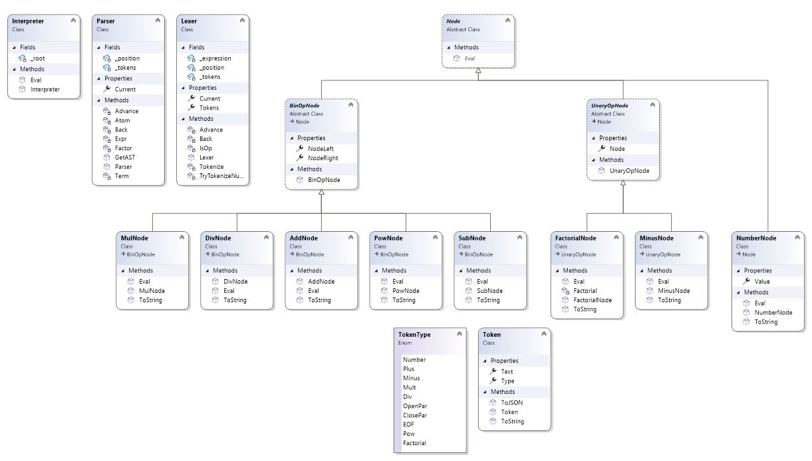

# Math Interpreter

Interpreter for most generic math expressions.

Includes:

- Integer and decimal numbers, e.g., "12.5", ".5"
- Summation, Substraction, Multiplication, Division
- Power and Factorial
- Unary operations, e.g., "--5", "-(...)"
- Correct interpretation of expressions including parenthesis ()

# Lexer

    /// Lexer receives math expression as a string and generates a list of tokens: PLUS, MINUS, NUMBER, etc.
    /// The list of tokens can be used as the input for a Parser
    /// 
    /// Example:
    /// input: "1+ .3"
    /// output: 
    ///     token 1 --> Type = Number, Text = "1"
    ///     token 2 --> Type = Plus, Text = "+"
    ///     token 3 --> Type = Number, Text = "0.3"
    /// 

# Parser

    /// Parser generates a unambiguous math expression given a list of tokens
    /// 
    /// It is built for this specific syntax grammar:
    /// expr ::= term { addop term }                                 ---> {} means 0 or more
    /// term ::= factor { mulop factor }
    /// factor ::= atom ['^' factor] | addop factor ['^' factor]     ---> [] means 0 or 1
    /// atom ::= (  number | '(' expr ')'  ) ['!']                   ---> (a | b) means a or b
    /// 
    /// where
    /// 
    /// addop ::= ('+' | '-')
    /// mulop ::= ('*' | '/')
    /// 
    /// With shorter syntax
    /// E ::= T { addop T }
    /// T ::= F { mulop F }
    /// F ::= A ['^' F] | addop F ['^' F]
    /// A ::= (  number | '(' E ')'  ) ['!']  
    /// 
    /// A number is any double (1, 12.3, .5)
    /// 
    /// The parser builds a tree using recursion
    /// You can access to a full parenthesized expression (unambiguous)
    /// by printing the root node (string)
    /// 
    /// 1+2*3 = (1+(2*3))
    /// (1+2)*3 = ((1+2)*3)
    /// -(-2+3) = (-((-2)+3))
    /// 1*2*3*4 = (((1*2)*3)*4)
    /// 1^2^3^4 = (1^(2^(3^4)))
    /// 1+2+3*4/5^6^7 = ((1+2)+((3*4)/(5^(6^7))))
    /// 
    /// This generated tree (or the full parenthesized expression)
    /// can be used by an interpreter
    /// to evaluate the expression without ambiguities
    
# Interpreter

    /// This interpreter does the actual math
    /// Given the root node of the parsed tree
    /// it computes the final value
    /// 
    /// This interpreter just visits all tree nodes
    /// generated from Parser. All nodes have an Eval()
    /// function that makes this interpreter extremely short
    /// 
    /// Just need to call the Eval() of the root
    /// and nodes will do their job!
    /// 
    /// NOTE: you can create another interpreter that receives 
    /// the full parenthesized expression instead of the root node.
    /// That interpreter would need different algorithms, e.g., 
    /// converting the full parenthesized expression in pre/post-fix mode
    /// and then evaluate it.
    /// In our case, it does not make much sense since we already have
    /// generated the abstract syntax tree with the Parser. With this
    /// approach the computation is absolutely magic "_root.Eval()".
    /// 
    /// Since our Lexer - Parser - Interpreter are quite dependent 
    /// it might have more sense to embeed the Lexer and Parser in the Interpreter
    
# Class Diagram

